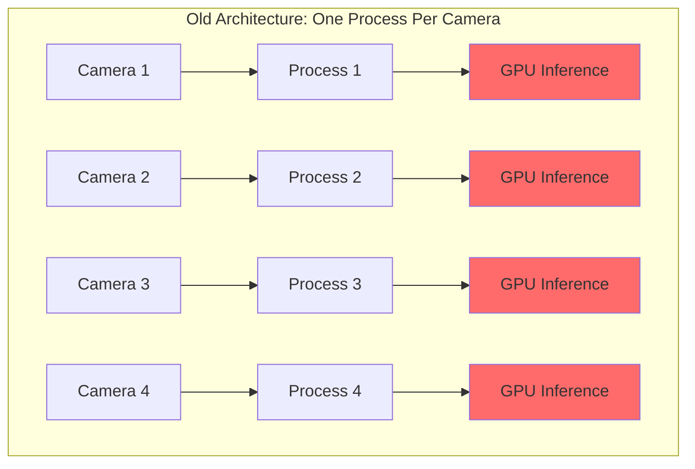
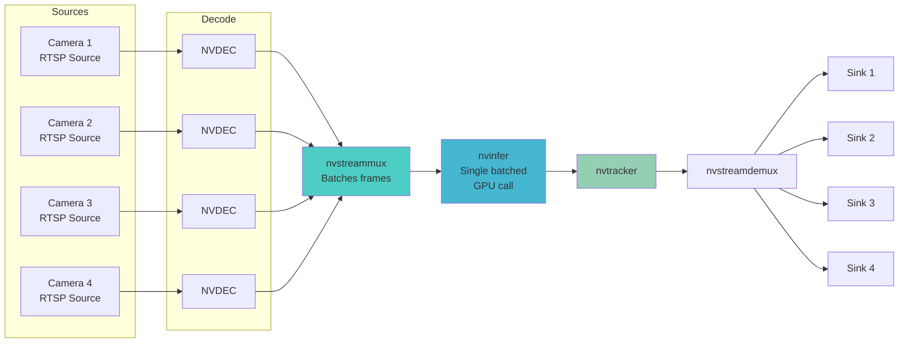
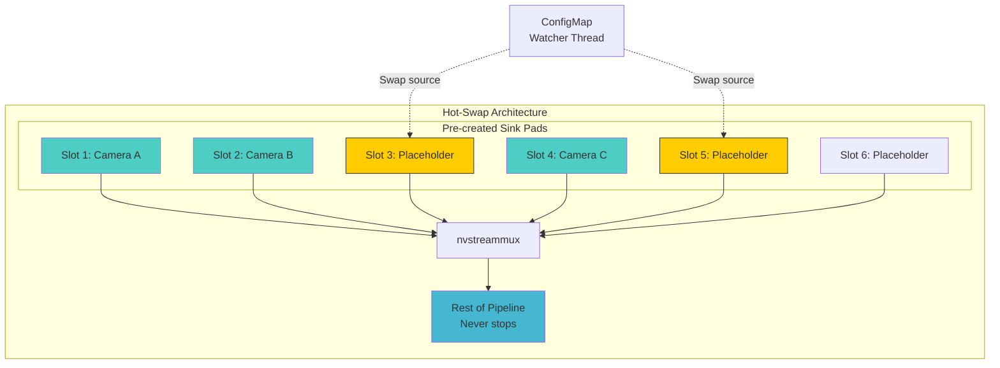
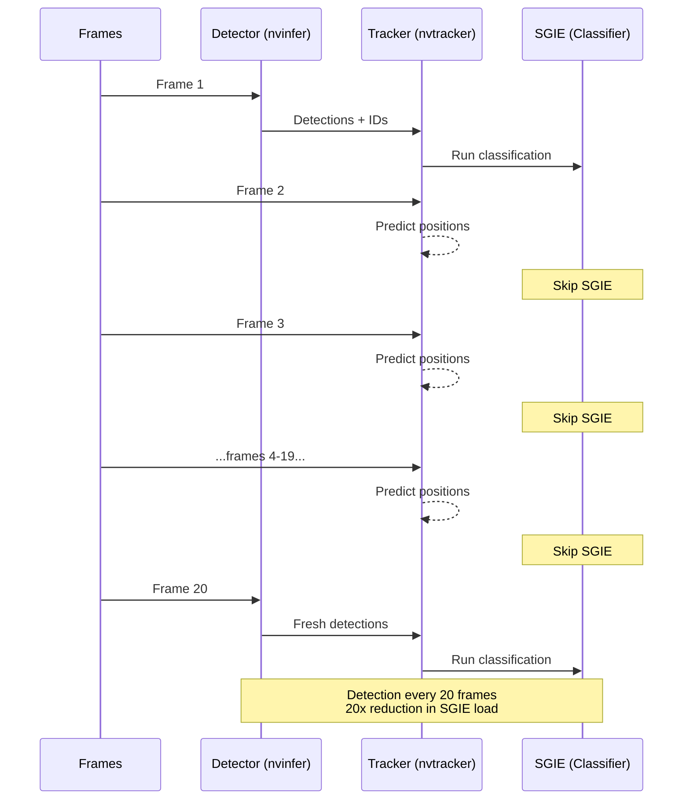
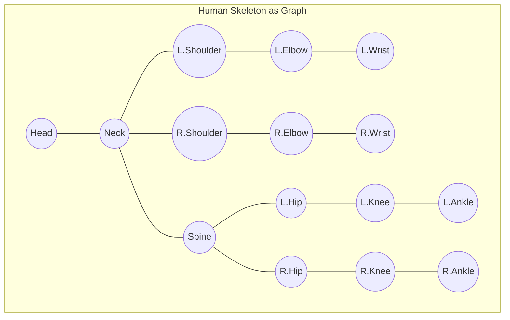
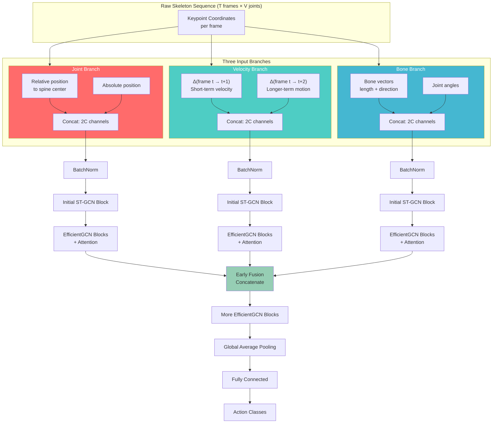
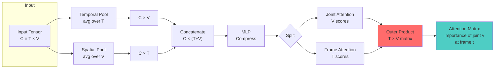
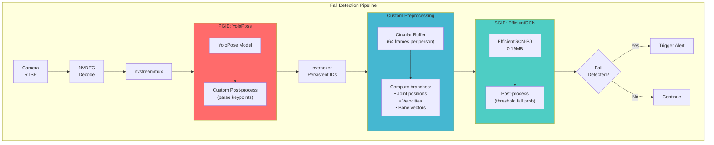

# On Watching Machines Watch Us

Jamnagar is the largest oil refinery on Earth. Miles of pipe. Temperatures that vaporize flesh. Pressure vessels that could flatten city blocks. Workers walking through it all in orange coveralls, hopefully wearing their hard hats.

**Our job:** build systems that notice when they forget.

---

## The Place

I flew out to see the site once, early on. *You can't build for a place you've never stood in.* The refinery hums—not one note but a chord. Bass from the pumps, steam valves hissing, metal striking metal somewhere you can't see. Heat off every surface. Workers moving through like they've done it a thousand times, because they have.

These aren't abstract users. **They're people who need to go home tonight.**

---

## The Mess We Inherited

The existing system was a disaster.

Each PPE check had its own model:
- **Gloves:** one neural network
- **Helmet:** another neural network  
- **Goggles:** third neural network

Three separate backbones extracting features from *identical pixels*, burning three times the compute for no good reason. The backbone is where most of the computation lives in any detection model—it's the feature extractor, the convolutional layers that transform raw pixels into meaningful representations. Running three of them on the same input frame is pure waste. You could share a single backbone and branch into separate classification heads, **cutting compute by roughly 60%**.

The models themselves were NVIDIA's TAO pretrained models—things like *PeopleNet* and *TrafficCamNet*—convenient for getting started with DeepStream but consistently underperforming compared to well-tuned open source alternatives.

### The Architecture Problem

The architecture was worse. Here's how a request flowed:

1. A request comes from the UI to run a model on a camera
2. The backend checks a database to see if that camera is already being processed
3. If not, it looks for an existing Kubernetes pod running fewer than four processes
4. If it finds one, it **kills that pod** and restarts it with a new configuration
5. If it doesn't find one, it spawns an entirely new pod using NodeJS APIs

One camera equals one DeepStream process. All processes are separate from one another. *Nothing shared.*

### What is DeepStream?

DeepStream is NVIDIA's SDK for building video analytics applications. It sits on top of **GStreamer**, a pipeline-based multimedia framework—you construct a directed graph of elements, each performing some transformation on the data flowing through.

DeepStream adds:
- **Hardware-accelerated video decode** via NVDEC
- **Inference** via TensorRT through the `Gst-nvinfer` element
- **Object tracking** via `Gst-nvtracker`

The pipeline abstraction means you can compose complex applications from simple building blocks:
1. A *source element* reads an RTSP stream
2. A *decoder element* converts H.264 to raw frames
3. An *inference element* runs a neural network
4. A *tracker element* maintains object identity across frames
5. A *sink element* writes results to file or streams them out

The power of this abstraction is that **batching happens naturally**. You can attach multiple source elements to a single `Gst-nvstreammux` element, which collates frames from different cameras into batches that flow through the rest of the pipeline together. One inference call processes frames from eight cameras simultaneously. The GPU stays saturated. Memory bandwidth is amortized across the batch.

*They weren't doing any of this.* One camera, one process. Ferrari delivering groceries.

---

## The Team

Team was small:
- **Three data scientists** handling model work
- **One backend engineer** building v2 on the side
- **Me:** responsible for one model, all DeepStream applications across all models, all deployments, and maintaining the existing backend while ripping out everything wrong with it

The detection model I left to colleagues. I'd spent college and internships fine-tuning YOLOs and BERTs—the rhythm becomes meditative after enough iterations. Data collection, labeling, hyperparameter sweeps, training, evaluation, repeat. *Good work.* I'd done enough of it.

The DeepStream stuff was where things got interesting.

---

## Fix #1: Batching

A DeepStream pipeline is a GStreamer pipeline, which means it follows GStreamer's model of elements connected by pads. Each element has:
- **Source pads** (outputs)
- **Sink pads** (inputs)

Data flows from source pads to sink pads through links. The `nvstreammux` element has multiple sink pads—one per input source—and a single source pad that outputs batched frames. On the other end, the `nvstreamdemux` element takes batched data and splits it back to individual streams.

With this architecture, **one pipeline handles eight cameras**. The `nvinfer` element receives a batch of eight frames and runs inference on all of them in a single GPU kernel launch. The memory transfer overhead between CPU and GPU happens once per batch, not once per frame.

> **Result:** Roughly 8x throughput improvement from a configuration change alone—no code modifications, just restructuring the pipeline topology.

---

## Fix #2: Hot-Swapping Cameras

GStreamer pipelines are technically dynamic—you can add and remove elements at runtime. But the plumbing is fiddly. Adding a new source to an already-running pipeline means:

1. Creating the source element
2. Creating a new sink pad on the `nvstreammux`
3. Linking them
4. Setting the element to PLAYING state

*All while the rest of the pipeline continues processing.* If you get the state transitions wrong, you deadlock. If you get the pad linking wrong, you leak memory or crash.

The previous system gave up on this entirely. Adding a camera meant stopping the pod and restarting with a new configuration. **That meant several minutes of downtime**—unacceptable at refinery scale.

### Our Solution: Pre-allocated Slots

We knew from GPU profiling exactly how many cameras we could handle per pipeline before inference latency became unacceptable: **sixteen**. So at pipeline startup:

1. Create sixteen sink pads on the `nvstreammux`
2. Link all to placeholder elements
3. When a camera needs to be added, replace the placeholder with a real RTSP source
4. When a camera needs to be removed, swap the source back to a placeholder

**The pipeline topology never changes; only the sources feeding into it do.**

A background thread polls a Kubernetes ConfigMap every few seconds. When the config changes—new camera added, existing camera removed, model parameters updated—the thread performs the necessary source swaps. **The inference loop continues uninterrupted throughout.**

---

## Fix #3: Intelligent Tracking

Running full neural network inference on every frame is expensive. At 30 FPS across eight cameras, that's **240 inference calls per second**. But object positions don't change much between adjacent frames—a person walking at normal speed moves maybe 10-20 pixels per frame.

You can exploit this temporal coherence by running detection *intermittently* and using a tracker to interpolate positions in between.

DeepStream's `Gst-nvtracker` element supports multiple tracking backends:
- **IOU tracker** — simple, fast
- **NvSORT** — Kalman filter based
- **NvDeepSORT** — with appearance features
- **NvDCF** — discriminative correlation filters

We used **NvDCF**, which maintains a discriminative correlation filter model per tracked object and updates it online as new detections arrive. The tracker receives detection results every N frames (we used N=20) and produces bounding box predictions for every frame in between.

### Why This Matters Beyond Performance

Without tracking, the same person walking across frame would trigger separate PPE violation alerts for each detection—potentially *dozens of alerts for a single event*. With tracking, we assign a persistent ID to each person. The alert logic becomes:

> "Person 47 has been in violation for 30 seconds"

Rather than:

> "We detected 900 separate violations in the last 30 seconds"

---

## The Fall Detection Challenge

Fall detection was the nightmare that kept coming up in safety team meetings.

*Someone goes down near heavy machinery. Every second of response delay matters.* Could we build a system that notices?

### The Constraint: Edge Deployment

Refineries have areas with limited connectivity, places where you can't rely on round-trip latency to a cloud GPU. We needed a model:
- **Small enough** to run on CPU
- **Fast enough** to process in real-time
- **Accurate enough** to avoid false alarms

Initial detection happens on-device; the system can phone home for confirmation from larger models afterward, but **the first alert has to be local and immediate**.

### Why Not Image-Based Action Recognition?

Image-based action recognition was too heavy. Models like *SlowFast* or *TimeSformer* consume entire video clips—16 or 32 frames—and run 3D convolutions or spatiotemporal attention over them. Accurate, but way too expensive for edge inference.

And we didn't need that level of visual understanding. Fall detection isn't about recognizing subtle actions; it's about detecting **abrupt changes in body configuration**. For that, skeleton data is sufficient.

### Why Graph Convolutional Networks?

The human body *is* a graph. Joints are nodes; bones are edges. An elbow is connected to a shoulder and a wrist, not to an ankle. This adjacency structure is fixed and known.

**Graph Convolutional Networks** let you build this prior directly into the architecture rather than forcing the network to learn it from data.

The core operation in a GCN is **neighborhood aggregation**. For each node, you:
1. Gather features from its neighbors
2. Combine them through a learned linear transformation
3. Apply a nonlinearity

Compare this to self-attention, where attention weights are *fully learned from data*. In a GCN, the weights are fixed by the graph structure—a node attends uniformly to its neighbors and ignores everything else. This is a **strong prior**, and when the prior matches reality (as it does for skeletal data), it dramatically improves sample efficiency and generalization.

---

## EfficientGCN: The Model

We used **EfficientGCN**. The original model was trained on NTU RGB+D, a large-scale action recognition dataset with:
- 60 action classes
- 25 body keypoints per frame
- 3D coordinates from Kinect depth cameras

We needed it to work with fewer keypoints in 2D from standard RGB cameras—a significant simplification, but one that dropped the depth camera requirement entirely.

### Three Input Branches

The model processes three input branches, each capturing different aspects of motion:

#### Joint Branch
Encodes **spatial position**. For each frame and joint, input consists of:
- Joint's position *relative to spine center* (pose independent of global location)
- Joint's *absolute position* (where in frame the action is happening)

#### Velocity Branch
Encodes **temporal dynamics**. For each joint at frame t:
- Displacement from frame t to t+1 (*short-term velocity*)
- Displacement from frame t to t+2 (*longer-term motion*)

Actions have characteristic velocity signatures—a fall involves sudden downward acceleration followed by abrupt deceleration on impact.

#### Bone Branch
Encodes **structural relationships**. For each pair of adjacent joints:
- Bone vector (endpoint minus startpoint, giving length and direction)
- Bone angle relative to reference axis

This captures body proportions and limb orientations that persist across frames.

### The Attention Mechanism

The attention mechanism is where EfficientGCN improves over prior work. Earlier approaches applied temporal attention and spatial attention *independently*. But this misses the point: **what matters is the importance of a specific joint at a specific time**.

A person's right hand at the moment of impact is highly informative for fall detection; that same hand ten frames earlier is not.

EfficientGCN computes joint-temporal attention scores *directly*. The outer product of joint importance scores and frame importance scores gives a **T×V attention matrix**, where entry (t,v) indicates the importance of joint v at frame t.

### Model Size

The scaling philosophy follows EfficientNet: a baseline architecture (B0) can be scaled up by increasing width and depth according to compound scaling rules.

| Metric | Value |
|--------|-------|
| Model Size | **0.19MB** |
| Original Accuracy (3D, 25 keypoints) | 86.5% mAP |
| Our Accuracy (2D, 14 keypoints) | 83.6% mAP |

A few points lost to reduced input dimensionality, but the model still worked.

---

## The Integration Challenge

DeepStream doesn't support keypoint data natively. The framework's metadata structures are built around bounding boxes (`NvDsObjectMeta`) and segmentation masks, not skeletal data. You can't just pass a list of (x, y) keypoint coordinates through the pipeline.

### Three Options

1. **Abuse existing structures** — Stuff keypoint coordinates into segmentation mask fields. Technically works, but anyone maintaining the code later will curse you.

2. **Custom post-processing library** — DeepStream's `nvinfer` element allows you to specify a `.so` file for custom post-processing. Requires managing memory carefully. *Not fun, but clean.*

3. **Fork and modify nvinfer** — Best result but requires maintaining a custom DeepStream build. Not worth it for our timeline.

**We went with option two.**

### The Full Pipeline

**Primary inference (PGIE)** runs YoloPose, a variant of YOLO that outputs both bounding boxes and body keypoints in a single forward pass. Our custom post-processing:
1. Parses the YoloPose output tensor
2. Extracts bounding boxes and keypoints
3. Creates `NvDsObjectMeta` entries for boxes
4. Allocates a separate buffer for keypoint data as a user-defined extension

**Between PGIE and SGIE**, a custom pre-processing element accumulates keypoints across frames. The GCN expects T=64 frames as input. The pre-processing element maintains a circular buffer per tracked object.

**Secondary inference (SGIE)** runs EfficientGCN on the prepared input tensors. Output is a probability distribution over action classes; our post-processing thresholds on the "fall" class probability.

---

## Edge Deployment: OpenVINO

For edge deployment, we built a proof-of-concept using Intel's **OpenVINO** toolkit and **DL Streamer** framework.

OpenVINO takes trained models in formats like ONNX or TensorFlow SavedModel, applies optimizations (layer fusion, quantization, memory layout transformations), and produces executables tuned for Intel CPUs, integrated GPUs, or VPUs.

The pipeline topology mirrored our DeepStream implementation:
- Source elements read from cameras
- Decoder elements convert to raw frames
- Inference element runs Intel's pose estimation model
- Tracking uses DeepSort with appearance features
- Our GCN runs on accumulated skeleton sequences

### Performance

| Metric | Value |
|--------|-------|
| Hardware | Single CPU core |
| Throughput | **45 FPS** |
| Includes | Multi-person pose estimation + tracking + fall classification |

Adequate for real-time processing of a single camera stream on an edge device with modest compute.

---

## The Recognition

In October 2024, the project won the **Gulf Energy Information Excellence Award** for Best Health, Safety or Environmental Contribution in the downstream category.

> "Pioneering AI-driven plant video surveillance project with Jio Platforms – Reliance Industries Limited."

Found out about it the way engineers usually find out about awards—*someone forwarded a link months after the ceremony.*

---

## Closing Thoughts

Somewhere in Gujarat right now, cameras are running. Pipelines flowing. Neural networks parsing frames nobody will ever watch, looking for missing helmets and sudden falls.

The work is invisible when it's working. Success measured in non-events. **Accidents not happening. Workers going home.**

*That's the point.*
