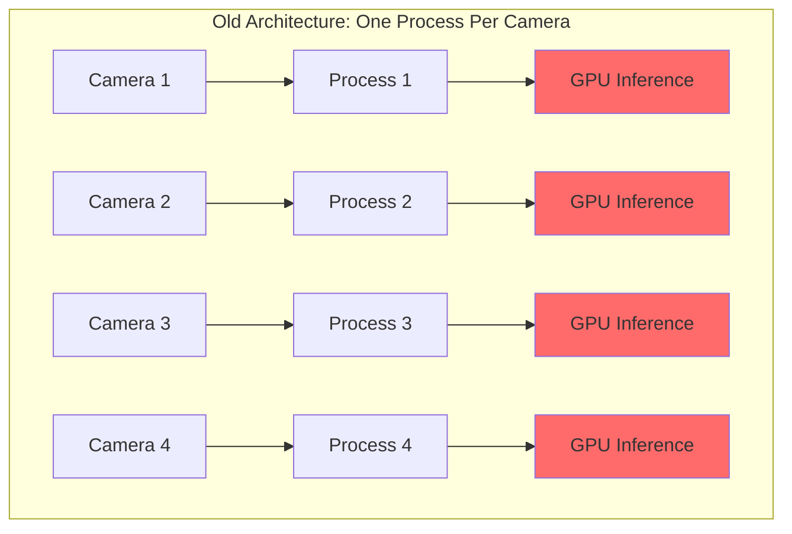
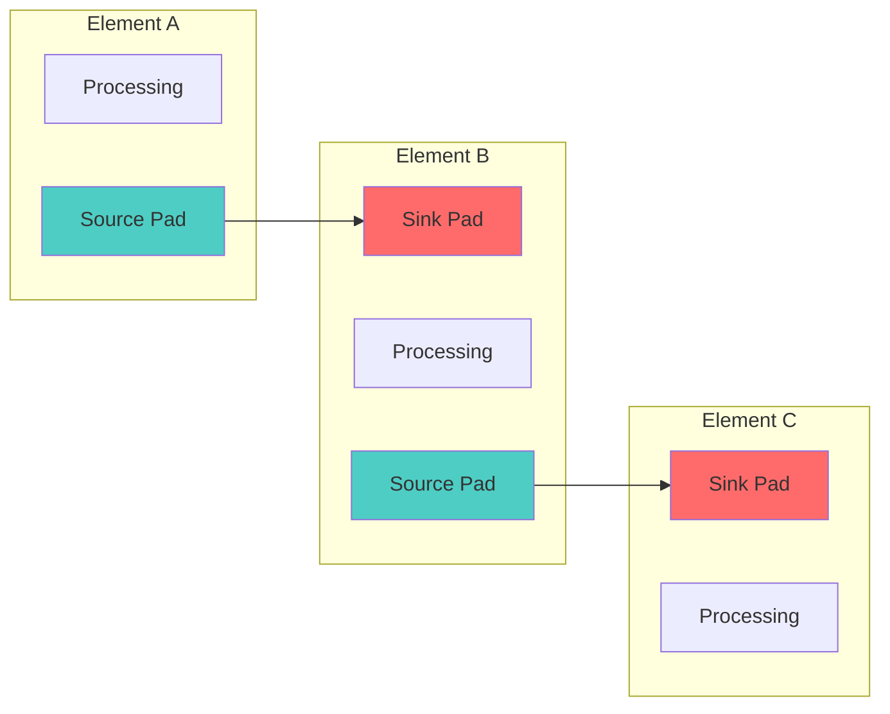
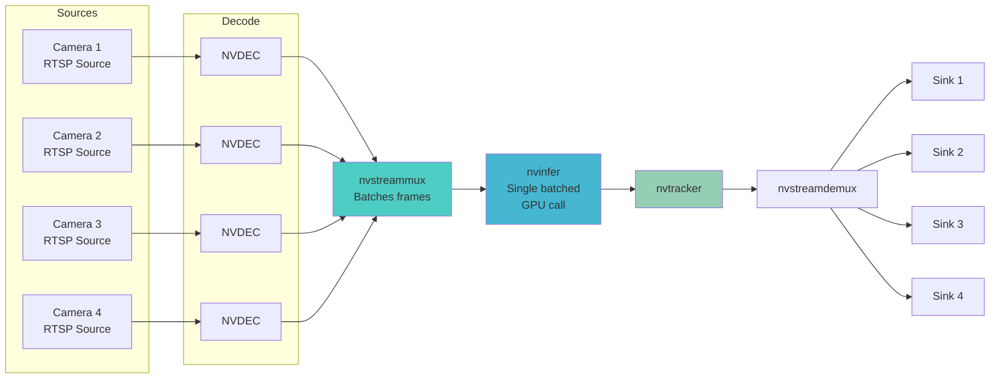
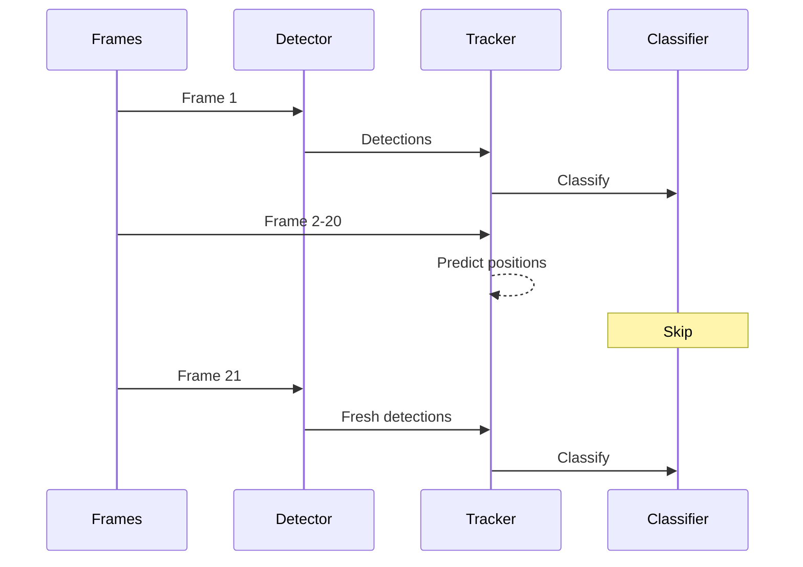
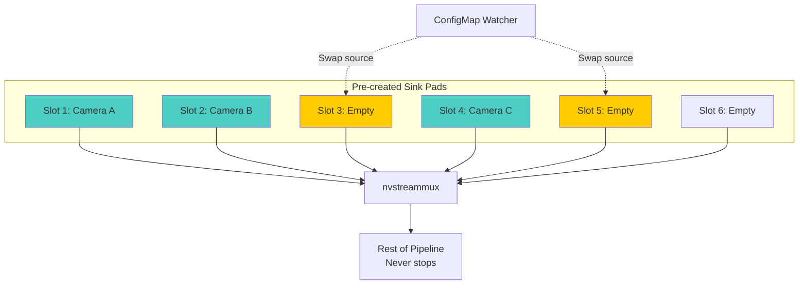
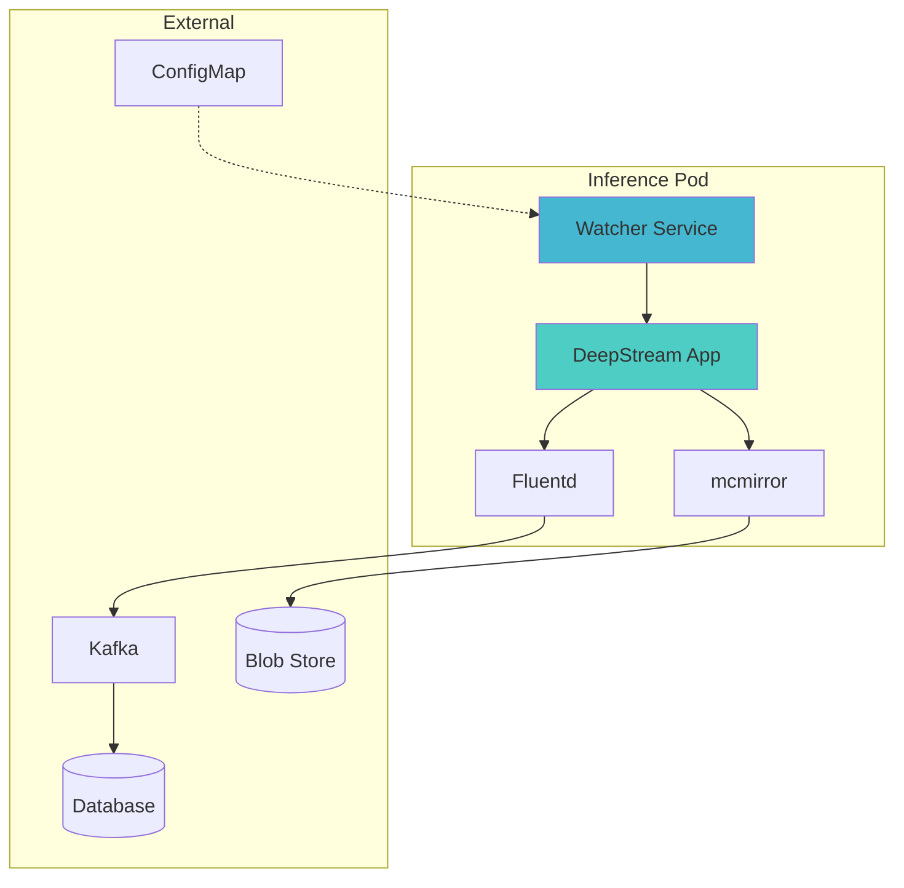
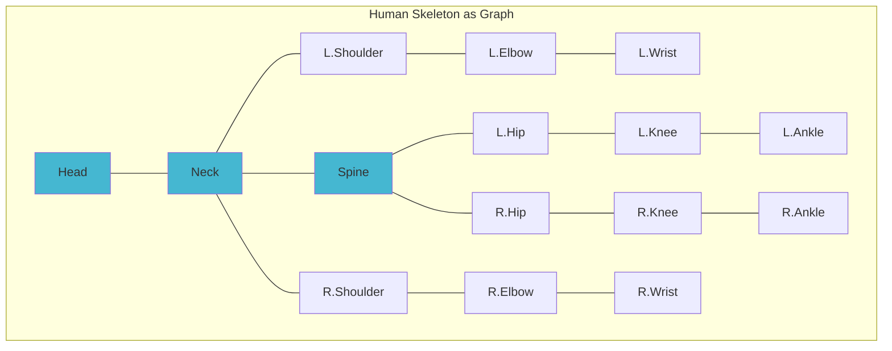
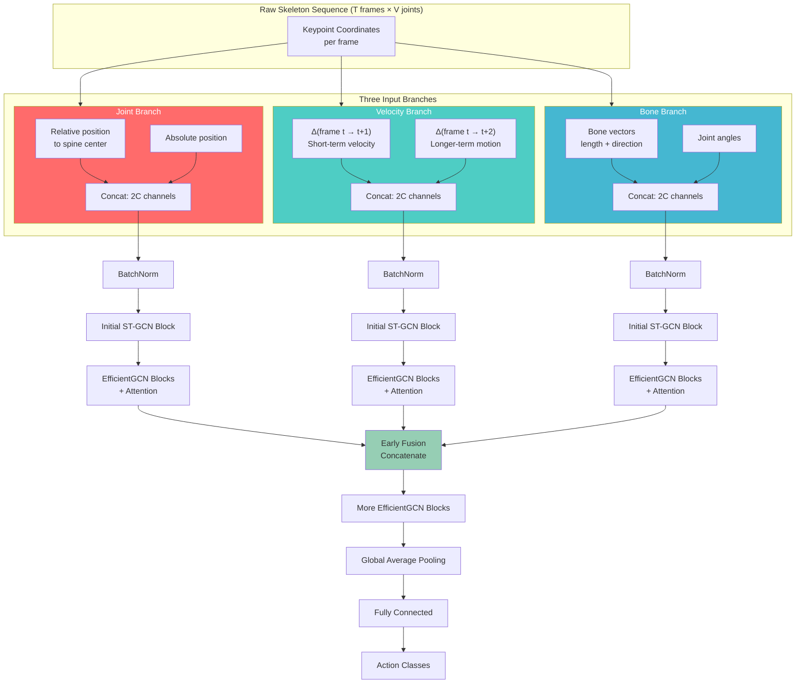
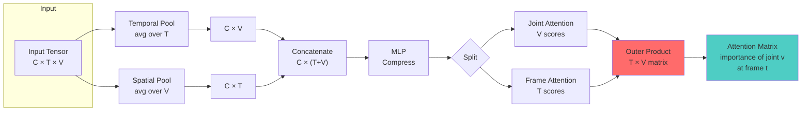
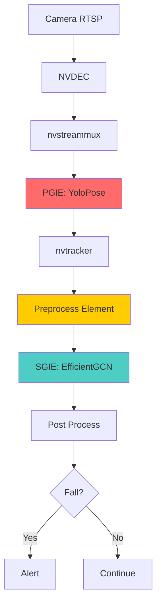

# Teaching Machines to Notice

Jamnagar is one of the largest oil refineries on Earth. Miles of pipe. Temperatures that vaporize flesh. Pressure vessels that could flatten city blocks. High-voltage switchgear humming behind chain-link fences. Confined spaces where harmful gases pool invisibly, odorless until they kill. Catwalks and ladders stretching a hundred feet up, slick with oil and monsoon rain. Flare stacks burning off excess gas, their heat warping the air. Workers walking through it all in orange coveralls, hopefully wearing their hard hats.

**Our job:** build systems that notice when they forget.

---

## The Place

I flew out to see the site once, in the middle of the project. The refinery hums. Not one note but a chord: bass from the pumps, steam valves hissing, metal striking metal somewhere you can't see. Heat radiates off every surface. Workers move through like they've done it a thousand times, because they have. It's a different feeling seeing up close the place and the people you're building for.

These aren't abstract users. **They're people with families waiting for them. They need to go home safely tonight.**

---

## The Problem

The scope was broad: PPE compliance (helmet, vest, goggles), fire and smoke detection, restricted region monitoring, spillage detection, safety shower verification. RTSP streams in, RTSP streams out with results overlaid in real-time. Alerts fired immediately and persisted to a database for later analysis.

The existing system, built by an earlier team, only handled PPE. And it handled it poorly.

### The Model Problem

Each PPE check had its own model:
- **Gloves:** one neural network
- **Helmet:** another neural network
- **Goggles:** third neural network

Three separate backbones extracting features from identical pixels, burning three times the compute for no good reason. You could share a single backbone and branch into separate classification heads, cutting redundant computation significantly.

The models themselves were NVIDIA's TAO pretrained models, things like PeopleNet and TrafficCamNet. Convenient for getting started with DeepStream, but consistently underperforming compared to well-tuned open source alternatives like YOLOv8.

We replaced it with a two-stage approach: person detection first (full body, grounded to floor), then classification on crops. Each class gets its own regression head, adding spatial context about where on the body the equipment should appear. We fine-tuned YOLOv8 small and nano variants on our data.

### The Architecture Problem

The deployment architecture was worse. Here's how a request flowed:

1. A request comes from the UI to run a model on a camera
2. The backend checks a database to see if that camera is already being processed
3. If not, it looks for an existing Kubernetes pod running fewer than four processes
4. If it finds one, it **kills that pod** and restarts with a new configuration (JSON generated based on model requirements)
5. If it doesn't find one, it spawns an entirely new pod using NodeJS K8s APIs

One camera equals one DeepStream process. All processes separate. Nothing shared.



### What is DeepStream?

DeepStream is NVIDIA's SDK for building video analytics applications. It sits on top of GStreamer (and by extension, FFmpeg), a pipeline-based multimedia framework where you construct a directed graph of elements, each performing some transformation on the data flowing through.

There's also a parallel ecosystem from Intel: DL Streamer built on OpenVINO. Similar concepts, different hardware targets. I'll write [another post](#blog/tools-of-the-trade) comparing these stacks and other toolings I've worked with and my opinions about them.

Why DeepStream matters:
- **Hardware-accelerated encode/decode** via NVDEC/NVENC
- **Optimized inference** via TensorRT (models converted to `.engine` format)
- **Zero-copy GPU memory:** the main performance win. No CPU↔GPU transfers between pipeline stages. Data stays on device.

The programming model: you construct a pipeline by connecting elements via pads. Source pads (outputs) connect to sink pads (inputs) of downstream elements. Each element can have properties you configure. Probes are Python or C++ functions that act as hooks, letting you access and modify metadata as it flows through.

The pipeline abstraction means you can compose complex applications from simple building blocks:
1. A *source element* reads an RTSP stream
2. A *decoder element* converts H.264 to raw frames
3. An *inference element* runs a neural network
4. A *tracker element* maintains object identity across frames
5. A *sink element* writes results to file or streams them out



The previous team wasn't exploiting any of this. One camera, one process. Ferrari delivering groceries.

---

## The Team

Team of five:
- **Three data scientists** handling almost all modeling work
- **One backend developer** building v2 as a generic product on the side
- **Me:** one model, all DeepStream applications across all models, all deployments, maintaining the existing backend, MLOps and ML infrastructure, removing inefficiencies end-to-end, contributing to v2 design

The detection models I largely left to colleagues. I'd spent college and internships fine-tuning YOLOs and BERTs. The rhythm becomes meditative after enough iterations: data collection, labeling, hyperparameter sweeps, training, evaluation, repeat. Good work but I'd done enough of it.

The DeepStream work and the GCN model training was where things got interesting.

---

## The Fixes

### Batching

A DeepStream pipeline follows GStreamer's model of elements connected by pads. Each element has source pads (outputs) and sink pads (inputs). Data flows from source to sink through links.

The `nvstreammux` element has multiple sink pads (one per input source) and a single source pad that outputs batched frames. On the other end, `nvstreamdemux` takes batched data and splits it back to individual streams.



With this architecture, **one pipeline handles eight cameras**. The `nvinfer` element receives a batch of eight frames and runs inference on all of them in a single GPU kernel launch. Memory transfer overhead happens once per batch, not once per frame. The GPU stays saturated. Memory bandwidth is amortized across the batch.

### Intelligent Tracking

Running full neural network inference on every frame is expensive. At 30 FPS across eight cameras, that's 240 inference calls per second. But object positions don't change much between adjacent frames. A person walking at normal speed moves maybe 10-20 pixels per frame.

You can exploit this temporal coherence by running detection *intermittently* and using a tracker to interpolate positions in between.

DeepStream's `Gst-nvtracker` element supports multiple backends:
- **IOU tracker:** simple, fast
- **NvSORT:** Kalman filter based
- **NvDeepSORT:** with appearance features
- **NvDCF:** discriminative correlation filters

We used NvDCF, which maintains a discriminative correlation filter model per tracked object and updates it online as new detections arrive. The tracker receives detection results every N frames (we used N=20) and produces bounding box predictions for every frame in between. Secondary inference (SGIE) only runs on detection frames, not tracked frames.



This gave us more than just performance gains. Without tracking, the same person walking across frame would trigger separate PPE violation alerts for each detection, potentially dozens of alerts for a single event. With tracking, we assign a persistent ID to each person. Alert logic becomes "person 47 has been in violation for 30 seconds" rather than "900 separate violations detected."

**With tracking enabled, we pushed from 8 to 32 concurrent camera streams per pipeline** while maintaining acceptable latency.

### Hot-Swapping Cameras

GStreamer pipelines are technically dynamic. You can add and remove elements at runtime. But the plumbing is fiddly. Adding a new source to an already-running pipeline means creating the source element, creating a new sink pad on `nvstreammux`, linking them, and setting the element to PLAYING state. All while the rest of the pipeline continues processing. Get the state transitions wrong, you deadlock. Get the pad linking wrong, you leak memory or crash.

The previous system gave up on this entirely. Adding a camera meant stopping the pod and restarting with a new configuration. That meant several minutes of downtime.

**Pre-allocated Slots**

You cannot add or delete pads at runtime without stopping the pipeline. But you can create them all upfront.

We profiled the pipeline on a T4 GPU (our production inference hardware) to find the sweet spot: maximum GPU utilization without exceeding memory limits or pushing latency past our threshold. The answer was thirty two streams per pipeline.

So at startup:

1. Create thirty two sink pads on `nvstreammux`
2. Link all to placeholder elements
3. When a camera needs to be added, swap the placeholder with a real RTSP source
4. When a camera needs to be removed, swap back to placeholder

Think of it like tubes existing within the pipeline. You're just slotting cameras into tubes or pulling them out. The topology never changes.



A polling mechanism checks a Kubernetes ConfigMap every few seconds. If a pod already exists for a use case and camera count is under 32, we simply add to it. No pod restarts needed.

### Custom Model Integration

Here's the catch with batching: DeepStream's `nvinfer` element only natively supports certain models, mostly NVIDIA's in-house ones like PeopleNet. To make fine-tuned open source models work, you need custom post-processing.

The solution: write a C++ shared library (`.so` file) with a function that serves as an entry point. You specify the library path and function name in `nvinfer`'s properties. The function gets called right after inference completes, receiving the output buffer. It parses raw tensor outputs however needed and attaches results to DeepStream's metadata structures.

```cpp
// Simplified example
extern "C" bool NvDsInferParseCustomYolo(
    std::vector<NvDsInferLayerInfo> const& outputLayers,
    NvDsInferNetworkInfo const& networkInfo,
    NvDsInferParseDetectionParams const& detectionParams,
    std::vector<NvDsInferObjectDetectionInfo>& objectList)
{
    // Parse YOLO output tensors
    // Populate objectList with detections
    return true;
}
```

---

## The New Architecture

We separated concerns into control plane and data plane.

Each pod contains:
- **DeepStream application:** the inference pipeline
- **Watcher service:** polls for configuration changes, handles camera add/remove
- **mcmirror:** forwards artifacts (clips, snapshots) to blob storage
- **Fluentd:** log aggregation

Logs flow from Fluentd to Kafka, then get batched and persisted to the database. The watcher service exposes an API to query which cameras are running on which pods.



Beyond PPE, we added fire detection, restricted region monitoring, safety shower compliance, and specialized PPE like arc suits.

---

## The Fall Detection Problem

Fall detection kept coming up in safety team meetings.

Someone goes down. Maybe near heavy machinery. Maybe from a stairwell or elevated platform. Every second of response delay matters. Could we build a system that notices?

### The Constraint: Model Size

The goal was a small, low-latency model—efficient enough to scale across many streams without saturating GPU resources. Initial detection could happen locally; alerts would propagate to cloud infrastructure where larger models could provide secondary confirmation.

We needed to avoid image-based action recognition. Models like SlowFast consume entire video clips and run 3D convolutions over them. I had used SlowFast for a [cricket action recognition project](#blog/cricket-shots-slowfast) with Mumbai Indians, classifying batting strokes. Accurate for that use case, but expensive. And importantly, SlowFast makes sense when you absolutely need visual cues to differentiate between actions.

Fall detection doesn't need that. It's about detecting **abrupt changes in body configuration**. For that, skeleton data is sufficient.

### Why Graph Convolutional Networks?

Several options existed for skeleton-based action recognition:

**RNN + Attention:** Good for long-range temporal modeling, but harder to train and overkill for fall detection where the signal is sudden and local.

**Temporal Convolutional Networks (TCN):** Good when spatial modeling isn't critical. Falls are inherently spatial.

**Graph Convolutional Networks (GCN):** Best fit. The human body is a graph. Joints are nodes; bones are edges. An elbow connects to a shoulder and a wrist, not to an ankle. This adjacency structure is fixed and known. GCNs let you build this prior directly into the architecture.

The core operation in a GCN is **neighborhood aggregation**. For each node, you:
1. Gather features from its neighbors
2. Combine them through a learned linear transformation
3. Apply a nonlinearity

Compare this to self-attention, where attention weights are *fully learned from data*. In a GCN, the weights are fixed by the graph structure—a node attends uniformly to its neighbors and ignores everything else. This is a **strong prior**, and when the prior matches reality (as it does for skeletal data), it dramatically improves sample efficiency and generalization.

The downside is that GCNs feel hand-engineered. You're explicitly encoding skeletal topology rather than learning it. But when the prior matches reality, it works.



---

## EfficientGCN

Current state-of-the-art GCN models for action recognition use multi-stream architectures with massive parameter counts. Highly sophisticated but overparameterized and computationally expensive.

EfficientGCN solves this: reduce parameters while maintaining performance.

The original model was trained on NTU RGB+D with 60 action classes, 25 body keypoints per frame, and 3D coordinates from Kinect depth cameras. We adapted it to work with 14 keypoints in 2D from standard RGB cameras.

### Three Input Branches

The model processes three input branches, each capturing different aspects of motion. Let C be the coordinate dimensions (2 for 2D, 3 for 3D).

**Joint Branch:**
- First C channels: joint coordinate relative to spine center (position independent of global location)
- Last C channels: absolute joint coordinate

**Velocity Branch:**
- First C channels: position at frame i minus position at frame i+1 (slow motion)
- Last C channels: position at frame i minus position at frame i+2 (fast motion)

Actions have characteristic velocity signatures. A fall involves sudden downward acceleration followed by abrupt deceleration on impact.

**Bone Branch:**
- First C channels: joint coordinate minus adjacent joint coordinate (bone length and direction, adjacency predefined)
- Last C channels: angle between these adjacent joints

This captures body proportions and limb orientations that persist across frames.



### Architecture Details

Each branch passes through batch normalization, then an initial block (same as ST-GCN: spatial graph convolution followed by temporal convolution) for feature extraction.

Then come two GCN blocks with attention. The attention mechanism here is key: **spatial-temporal joint attention**. Considering frames and joints separately is suboptimal. What matters is the importance of a specific joint at a specific time.

The attention works like this:
1. Input tensor shape: C × T × V (channels × frames × joints)
2. Temporal pooling: average over T, get C × V
3. Spatial pooling: average over V, get C × T
4. Concatenate: C × (V + T)
5. Pass through a neural network to compress
6. Split into two separate networks: one outputs frame importance scores (T values), one outputs joint importance scores (V values)
7. Outer product of the two: T × V matrix where entry (t, v) indicates the importance of joint v at frame t



A person's right hand at the moment of impact is highly informative for fall detection; that same hand ten frames earlier is not.

After two attention-augmented GCN blocks per branch, the features are concatenated (early fusion makes training efficient). The main stream has two more GCN blocks with attention, followed by global average pooling and a fully connected layer.

### Scaling and Results

EfficientGCN follows EfficientNet's scaling philosophy. The B0 variant is tiny (0.19MB). You can scale up by increasing width and depth.

| Metric | Value |
|--------|-------|
| Model Size (B0) | **0.19MB** |
| Original Accuracy (3D, 25 keypoints) | 86.5% |
| Our Accuracy (2D, 14 keypoints) | 83.6% |

A few points lost to reduced input dimensionality, but the model still worked.

---

## Integration

DeepStream doesn't support keypoint data structures natively. The framework's metadata is built around bounding boxes and segmentation masks.

Three approaches:

1. **Hacky:** abuse segmentation mask fields, disable display. Quick but problematic long-term.
2. **Middle path:** define custom structs in the `.so` file, use `cudaMemcpy` to manage GPU memory. Requires managing memory carefully. *Not fun, but clean.* This is what we did.
3. **Best but most involved:** fork and modify `nvinfer` itself to support keypoints. Not worth it for our timeline.

### The Full Pipeline



**PGIE (Primary Inference):** YoloPose, a YOLO variant that outputs bounding boxes and body keypoints in a single forward pass. Custom post-processing (C++) extracts both, creates standard metadata for boxes, allocates separate buffers for keypoint data.

**Preprocess Element:** Custom element that accumulates keypoints across frames. EfficientGCN expects 64 frames as input. The element maintains a circular buffer per tracked object and prepares all three input tensors (joint, velocity, bone). Temporal batching and coordinate transformations happen here, all in C++.

**SGIE (Secondary Inference):** EfficientGCN. Output is a probability distribution over action classes. Post-processing thresholds on the fall class probability.

---

## Coda

In October 2024, the project won the Gulf Energy Information Excellence Award for Best Health, Safety or Environmental Contribution in the downstream category. "Pioneering AI-driven plant video surveillance project with Jio Platforms and Reliance Industries Limited."

Found out about it the way ICs usually find out about awards: got forwarded a link months after the ceremony.

But that's not really the point.

Somewhere in Gujarat right now, cameras are running. Pipelines flowing. Neural networks parsing frames nobody will ever watch, looking for missing helmets and sudden falls.

The work is invisible when it's working. Success measured in non-events. **Accidents not happening. Workers safely going home to their families.**

That's what matters.
